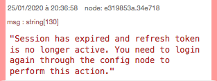

# Somfy Tahoma for Node-RED

## Setup

You can read this [guide](https://nodered.org/docs/getting-started/adding-nodes) from Node-RED official portal. This will help you install this node. Typically, the command are as follows:

	cd $HOME/.node-red
	npm install node-red-contrib-tahoma 

## Disclaimer
This software is provided **as-is**. Be careful: your devices can be fully controlled via API actions. I am not responsible of any mis-usage or corruption of the devices configuration.

## Configuration

In order to use this node, you need to have a Somfy account. If you already use the Tahoma Box and the mobile apps, you should have one.

You will also need to create an app on the developer portal in order to retrieve a set of required credentials. This [guide](https://github.com/nikkow/node-red-contrib-tahoma/wiki/How-to-create-an-Somfy-Open-API-app%3F) will walk you through this process.

When creating your first node, you will be asked to provide your e-mail and password used to login to your Somfy account. These will be used to connect to the API (of course, they will only be used locally, they are not forwarded to me :)).

## Usage

### Node `tahoma`

This node accepts an object as input. The following properties will be parsed:

| Property | Type | Required? | Description |
| -------- | ---- | --------- | ----------- |
| `action` | enum (see below) | **Yes** | The action to perform |
| `position` | int (0-100) | *No* | The position you want to set your blinds/door to |
| `lowspeed` | boolean | *No* | Should the action be triggered in low-speed mode? |

#### Actions

Currently, only a few commands are understood by this node. The possible values for the `action` property are:

* `open`: This will open the device (door, blind...)
* `close`: This will close the device
* `stop`: This will stop all running actions
* `customPosition`: This will set the device to a custom position. The position is passed using the `position` property, which is required in this mode.

#### Output

The node will output its original `msg.payload` enriched with the result of the expected action. `msg.payload.output` will contain 2 properties:

* `open`: a boolean. Set to true if the device is open, or false otherwise
* `position`: an integer (0-100). Set to the position returned by the Tahoma box.
* `luminance`: in case of a Sun Sensor, returns the current value of core:LuminanceState (See issue [#6](https://github.com/nikkow/node-red-contrib-tahoma/issues/6))

### Node `tahoma-read`

This node does not accept any input. You can specify the desired device by editing the node properties.

#### Output

The node will output its original `msg.payload` enriched with the selected device information. A full example can be found on the Somfy Open API [documentation](https://developer.somfy.com/somfy-open-api/apis/get/site/%7BsiteId%7D/device).

## Example flow

An example flow can be found in the docs/ folder. Basically, all it does is close and open shutters based on manual triggers. Those can be replaced by some logic (e.g. a node calculating the sunset and sunrise times). The output is sent to a local MQTT broker. 

## Compatibility

This was tested with the following devices:

* IO-HomeControl Roller Shutters
* IO-HomeControl Garage Door
* Sunea IO Awning (thanks to @xeor)

Feel free to send any feedback of any other compatible items or known limitations :)

## FAQ / Troubleshooting

### I received a "Session expired" error, what happned?

 

During the login process, Somfy generates a set of credentials composed of two tokens: the first is called an **access token** and the second a **refresh token** (following the [OAuth2](https://oauth.net/2/) protocol). 

Both these tokens expire at some point. 

The **access token** (used to authenticate each request sent to Somfy API) has a very short lifetime (1 hour) and needs to be regenerated afterwards. To prevent you from entering your e-mail/password each hour, the **refresh token** handles this new authentication. Whenever the access token expires, a new authentication request is sent and Somfy generates a brand-new set of tokens.

However, the **refresh token** has not an infinite lifetime. It expires after **14 days**. Basically, it means that if node-red hasn't reached the Somfy API for 14 days + 1 hour, both your token have expired and you need to login again. 

#### What should I do?

This error is also described in the "Debug" tab of your node:

 

All you need to do is open your node configuration, edit your account and follow the instructions on the yellow box:

**Note:** do not forget to **deploy** your flow, so the new credentials are properly saved. 
